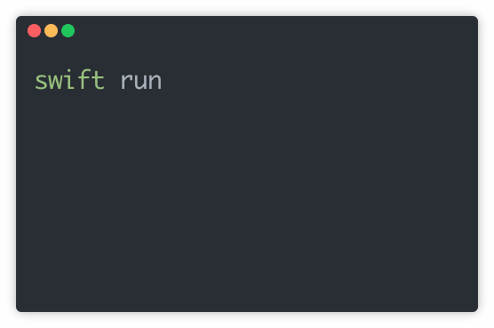

# Swift CLI Spinners
[](https://travis-ci.com/dominicegginton/Spinner)
> Full featured `Swift` library for creating powerful terminal Spinners 🔥

<p align="center">
	<br>
	
	<br>
	<br>
</p>

## Key Features
- Over **60** built in animations 🤩
- Built in completion functions (Success, Failure, Warning, Information) ✔
- Easily create your own custom animations
- Only bug free Spinner library built in `Swift` on Github

## Install 
To install within your `Swift` project add the GitHub url to your `Package.swift` file as a dependency. 
[**Swift Package Manger**](https://swift.org/package-manager/) will sort everything out for you when you run `swift build` 💪
``` swift
.package(url: "https://github.com/dominicegginton/Spinner", from: "1.0.0")
```
## Usage
Full documentation can be found on the Wiki.
#### Creating a Spinner
Display a simple Spinner for a couple of seconds easily 😀
```swift
let mySpinner = Spinner(.dots, "My Custom Spinner")
mySpinner.start()
sleep(2)
mySpinner.stop()
```
#### Color 🎨
Adding a splash of color is easy and has been integrated using [`Rainbow`](https://github.com/onevcat/Rainbow). 
```swift
let mySpinner = Spinner(.dots, "My Spinner", color: .cyan)
```
#### Completion Types ✅
Providing users with spinner completion type can be very useful, for example: 🤔 calling `.succeed()` will stop the spinner and display a green ✔. You may also want to provide the spinner with a final string to display to the user.
```swift
mySpinner.succeed("Passed")
```
#### Stopping a Spinner 🛑
When calling a completion type inst desired the stop function takes final data that the spinner will display, for example: 
```swift
mySpinner.stop(finalFrame: "!", text: "Final Text")
``` 
#### Creating Custom Patterns 🔥
We have **60** animated spinner patterns for you to choose from however you may want to create your own. This can easily be done by defining a multiFrame `SpinnerPattern()`, the default speed for custom multiFrame patterns is `0.08`, to change with pass a double representing the speed to the init of the Spinner.
```swift
let customPattern = SpinnerPattern(multiFrame: ["1","2","3","4","5"])
let mySpinner = Spinner(customPattern, "My Spinner", speed: 0.3)
```
#### Updating Spinners
All properties of the Spinners object can be updated on the fly by calling a update function, for example: 🤔
```swift
let mySpinner = Spinner(.dots, "My Spinner")
mySpinner.start()
sleep(2)
mySpinner.updateText("Updated Text")
sleep(3)
mySpinner.stop()
```

## Community

Many thanks for the 60 plus spinner frames that can be found over at [sindresorhus](https://github.com/sindresorhus/cli-spinners) repo build in JavaScript.
